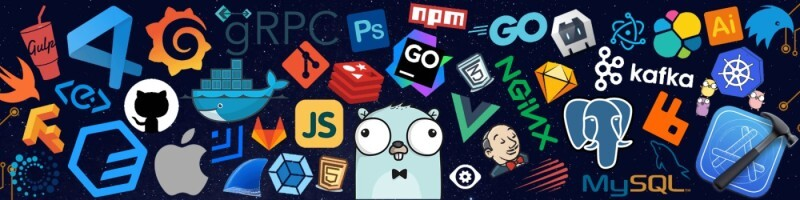

<h1 align="center">Hi there, I'm Muhammad Abdullah 👋</h1>
<h3 align="center">🚀 IT Student | Aspiring Full-Stack Developer | WordPress → JavaScript → React/Node</h3>

  

  

---

### 🧑‍💻 About Me

Hi! I'm **Abdullah**, an IT student and aspiring **Full-Stack Developer** with a strong interest in building real-world digital solutions.

I started my development journey with **WordPress**, where I learned how to create modern, responsive, and business-focused websites for different types of businesses. Currently, I'm expanding my skills in **JavaScript, React, Node.js, databases, APIs, and full-stack development**, while working on practical projects and experimenting with new technologies.

I'm especially interested in turning ideas into useful web applications and eventually building **scalable SaaS products** that solve real business problems.

> 💡 I believe the best way to learn development is by building, solving problems, and continuously improving — and that's exactly what I'm doing.

- 🌱 Currently learning **Full-Stack Development**
- 💬 Ask me about **Full-Stack Development & WordPress**
- 📫 Reach me at **muhammadabdullah53897@gmail.com**
- ⚡ Fun fact: I turn ideas into apps, one bug fix at a time 🐛

---

### 🛠️ Languages & Tools

  
  
  
  
  
  
  
  
  
  
  

---

### 📊 GitHub Stats

  
  

  

---

<h3 align="left">🌐 Connect with me:</h3>

  

